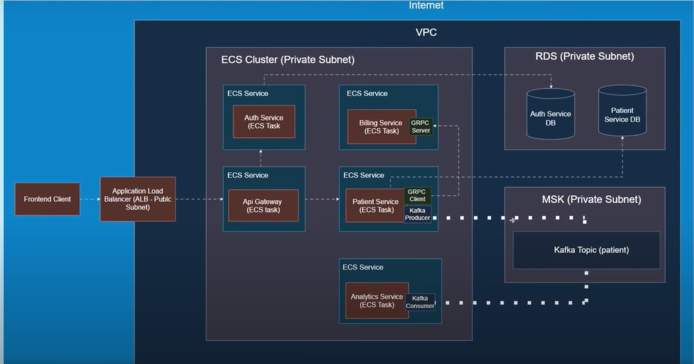

# Patient Management Backend

A patient management backend built using microservices architecture with Java Spring Boot. This project leverages modern tools and patterns to ensure scalability, resilience, and ease of integration. It features Kafka-based event streaming, gRPC for inter-service communication, JWT-based authentication, and extensive integration testing.

---

## Table of Contents

- [Overview](#overview)
- [Architecture](#architecture)
- [Key Features](#key-features)
- [Technologies Used](#technologies-used)
- [Setup & Installation](#setup--installation)
- [Deployment](#Deployment)

---



## Overview

The Patient Management Backend is designed to support robust patient data handling and administrative tasks. Its microservices-based approach breaks down responsibilities into dedicated services including:

- **Patient Service:** Handles patient CRUD operations.
- **Billing Service:** Manages billing operations via gRPC.
- **Analytics Service:** Consumes Kafka events for real-time analytics.
- **Authentication Service:** Provides JWT-based login and token validation.
- **API Gateway:** Routes requests securely between external clients and internal services.

Each service is containerized using Docker and can be deployed on cloud infrastructure with support for continuous integration and deployment.

---

## Architecture

The project embraces a distributed microservices architecture:

- **Service Communication:**  
  - **gRPC** is used for high-performance synchronous calls (e.g., patient-to-billing interactions).  
  - **Kafka** handles asynchronous messaging, ensuring events (like patient creation, updates, or deletions) are reliably published and consumed.
- **Security:**  
  - **JWT Authentication** secures API endpoints. The auth service issues tokens that are validated across microservices.
- **Testing:**  
  - **Integration Tests** are implemented to validate the end-to-end behavior of service interactions.
- **Deployment:**  
  - Docker and AWS (using LocalStack for local simulation and CloudFormation for infrastructure as code) streamline the deployment process.


---

## Key Features

- **Microservices-Based:** Isolated, independently deployable services.
- **Event-Driven:** Uses Kafka for real-time event streaming between services.
- **Inter-Service Communication:** gRPC enables efficient, type-safe remote calls.
- **Security:** JWT is implemented for user authentication and authorization.
- **Extensive Testing:** Integration tests ensure all service interactions perform as expected.
- **API Gateway:** Centralized routing with custom rules and security filtering.
- **Containerization & Cloud Deployment:** Dockerized services with AWS local simulation and CloudFormation templates for production readiness.

---

## Technologies Used

- **Programming Language:** Java
- **Framework:** Spring Boot
- **Inter-Service Communication:** gRPC
- **Messaging:** Apache Kafka
- **Security:** JWT (JSON Web Tokens)
- **Containerization:** Docker
- **Cloud & Deployment:** AWS, LocalStack, CloudFormation
- **Testing:** JUnit, Spring Integration Tests

## Setup & Installation

1. **Clone the Repository:**

   ```bash
   git clone https://github.com/yourusername/patient-management.git
   cd patient-management

## Deployment

Prerequisites
Before deploying, ensure you have the following:

1. AWS CLI installed and configured on your machine.
2. LocalStack running locally.
3. AWS CDK installed.

chmod +x localstack-deploy.sh
./localstack-deploy.sh

After deployment, the script will provide the DNS name of the load balancer. Use this to access your deployed application:
http://<load-balancer-dns-name>:<port>
